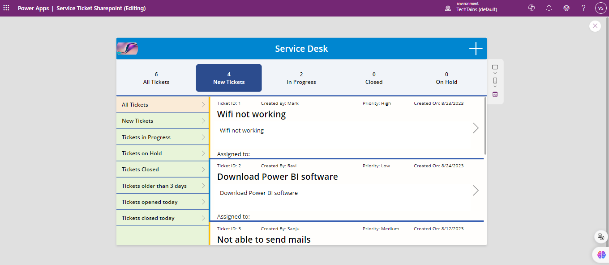
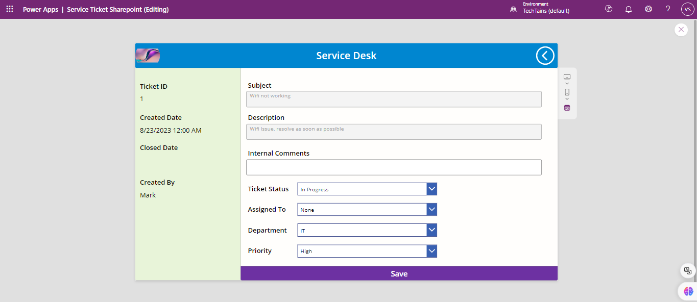
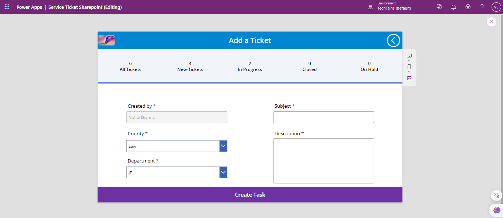

# Service Desk Canvas App

This Power Apps-based Service Desk app allows users to manage and track service tickets. The app integrates with SharePoint to store and retrieve ticket data. The app consists of three main screens: **Home**, **Detail/Edit**, and **Create**.

## App Features

- **Home Screen:** Displays all service tickets.
- **Detail/Edit Screen:** View and edit the details of a specific ticket.
- **Create Screen:** Allows users to submit new tickets.
- **SharePoint Integration:** Tickets are stored in a connected SharePoint list.

## App Screenshots

### Home Screen

_Displays a list of all tickets with an option to filter by status._

### Detail/Edit Screen

_Shows detailed information about a selected ticket with an option to edit the ticket._

### Create Screen

_Allows users to create a new service ticket by filling out a form._

## SharePoint List Structure

- **Subject:** Ticket subject
- **Description:** Issue details
- **Department:** Ticket department (HR, Finance, etc.)
- **Status:** Current ticket status (Open, In Progress, Resolved)
- **Assigned To:** Person handling the ticket
- **Priority:** The urgency level of the ticket (Low, Medium, High)
- **Created By:** The user who created the ticket
